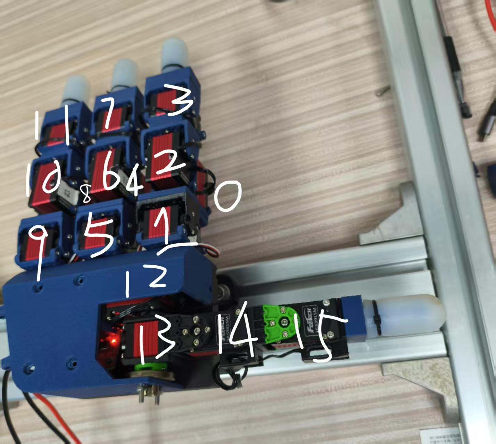
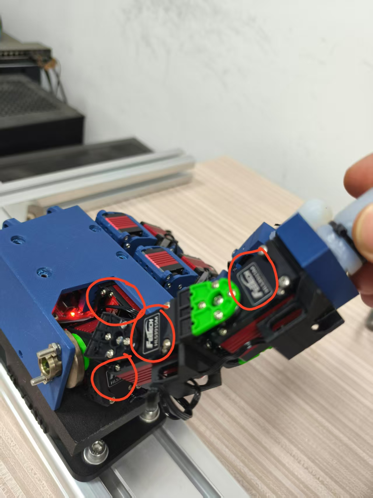
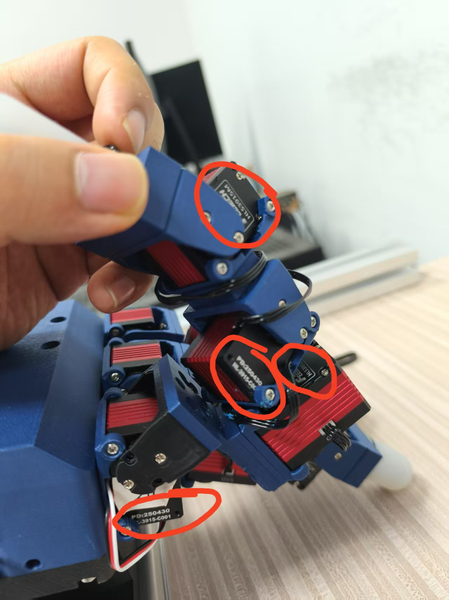
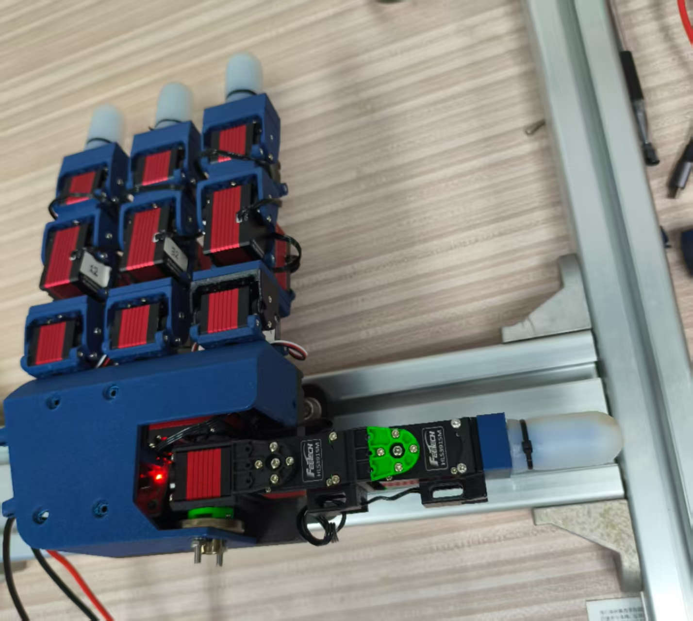

## 硬件准备及安装

由于使用的FT电机与Leap Hand原装XC330电机尺寸、转轴、固定孔位置**完全相同**，仅有控制线插口位置不同，我们可以大致使用

[原版LeapHand组装教程]: https://v1.leaphand.com/assembly

进行灵巧手硬件的安装。但正由于其控制线插口位置不同，我们需要对部分XC330配套的结构件进行调整并以3D打印的方式制作，我们需要替换其中由Dynamixel提供的电机支撑件。具体地，将所需的16个H101，10个S101以及6个S102使用本项目中`STLSubstitute`文件夹中对应的模型替换（由于它们足够相似，仿真中可以不用替换）。其中S101有两个版本，分别是需要8片的普通版和2片的Slim版。Slim版用于侧面不能突出的大拇指第二关节部分。

#### 3D打印部分

从LeapHand官网下载对应的模型进行打印，与本项目中提供的结构件一起即可组成灵巧手的全部硬件结构。官网下载部分的模型对于精度及强度要求均略低于直接用于固定电机的结构件，经过我们测试全部使用PLA进行打印即可满足基本强度要求，但使用更加坚固的PETG进行打印有助于减少需要由于误操作部件损坏重新组装灵巧手的次数。

#### 硅胶指尖制作

我们的演示程序使用的并非原版的Leap Hand灵巧手指尖。这些特制的指尖由硅胶倒模方式制作，经测试5度硅胶效果最好。在`CustomTip`文件夹中有制作硅胶部分用的内外模具的模型（取决于计划一次做好或分四次完成，打印4份或1份）及为指尖提供结构强度的”指骨“模型（安装在每个手指上，需要4个）。具体制作过程如下

- 打印内外模具（内模需要打印支撑以免打印失败）
- 在将与硅胶接触的部分涂抹一薄层凡士林以便之后脱模
- 在外模内倒入硅胶，以插入内模后刚好液面可接触到内模顶盖处为佳
- 放置与冰箱冷藏室中减速凝固，以便气泡排出。
- 在执行下一步之前先按照Leap Hand官方教程为指骨埋入土字铜花母
- 待其凝固后（具体多久并未测试，但放一晚肯定够了）脱模，并使用束带将其固定在指骨上。

#### 电机初始设置

使用本项目中附带，由飞特提供的上位机软件`FD.exe` 进行各电机ID设置与波特率设置。（除非你懂得如何修改相关文件，不然推荐使用我们的电机ID顺序，如下图，波特率同理）。除大拇指外的三只手指从手掌到指尖按结构顺序ID分别为[x+1, x, x+2, x+3]，手指顺序为食指、中指、四指、拇指。对全新电机进行设置的具体顺序如下：

- 连接**单一一个电机**打开上位机软件，左上方波特率选择1000000，打开接口并电机搜索。
- 理论上新电机会以ID=1的状态被搜到，点击左侧搜到的电机，选择中上方的Programming页面。这里是各个寄存器的值，你可以通过这个界面具体检查电机各项设置
- 将ID改为你所需要的ID（我们建议先将16个电机依次更改ID为0-15并贴条记录，之后安装时按照对应ID安装）。**如果你不知道你在做什么，请保持副ID（Secondary ID)与主ID相同**
- 更改后电机会成为断连状态，重新给电机上电后重新搜索，电机将以新的ID出现。回到Programming界面将波特率baudrate改为115200。
- 换一个电机，重复以上步骤直至全部16个电机完成初始ID设置。




#### 组装

基本组装流程和LeapHand完全相同，但有几点需要注意

- 由于我们更改了S101及H101的模型，现在H101不同于原版，由于其单侧开槽的原因具有方向性。这一特点是为了能让螺丝固定部分更宽的修改版S101不影响手指活动空间的设计。你可以通过在一个单独电机上同时安装S101和H101了解其结构关系。在组装时应注意H101的开槽要面向S101一侧，具体地，对于2、3、4指来说其每指三个H101开槽的方向以手掌到指尖的顺序依次为掌心、手背、掌心。
- 电机有安装方向之分，但不管装正装反都不影响灵巧手本质结构，可以用电机Logo及型号两面的朝向分辨其安装方向。我们组装的灵巧手各电机方向如下图（2、3、4指朝向相同），如果你组装的手和我们的电机朝向相同，那么在完成后续“电机设置”一节完成后你应该得到正方向与Leap Hand官方仿真完全相同的结果。你可以选择使用与我们相反的方向安装0,3,4,7,8,11,12,13号电机，即可在后续“电机设置”一节中跳过使用mode3将电机反向的步骤。

|              拇指               |            其余三指             |
| :-----------------------------: | :-----------------------------: |
|  |  |

## 安装飞特电机驱动&调试电机

####  环境安装与初次运行

**注意：在进行这一步之前你需要先决定使用ROS2或ROS1,因为其涉及的python版本不同。而由于ROS对于虚拟环境的支持问题，我们需要将后续所有会在硬件侧ROS node中用到的包都装在对应版本的系统python中。当然如果你不确定，你可以可以先在任意一个版本的python下安装调试**。*以下以ROS2使用的Python3.10为例*

```shell
sudo apt install python3-pip #万一有人还没装pip
python3.10 -m pip install ftservo-python-sdk numpy # 飞特电机官方SDK & numpy
sudo apt-get purge brltty # 卸载BrailleTTY盲人输入装置驱动，这东西会很霸道地hijack每个插入的serial设备，除非你会使用这种装置，建议直接卸载。如果你遇到插上手搜不到/dev/ttyUSB0,很可能是它的问题。
sudo usermod -a -G dialout $USER #我们的灵巧手是用Serial方式连接在电脑上的，对于Linux来说，它需要dialout权限才能存取这种设备，这里是赋予本用户这个权限
```

由于我们更改了本用户权限，重启电脑才能使这个改动发挥作用（log out都不行）。之后使用对应版本的python运行`FT_Client.py`，这是主要的硬件控制api，但直接运行它可以帮助你进行调试。调试程序有两个版本：mode 0 只读取每个关节目前的角度而不进行控制，而mode 1 则让每个关节进行小幅正弦波摆动。目前我们**还未对电机进行归零，使用mode1有炸机风险**。运行mode 0：

```SHELL
python3.10 ./scripts/FT_client.py -m 0,1,2,3,4,5,6,7,8,9,10,11,12,13,14,15 --mode 0 #-m指定电机ID,尽量别动。其它设置还有 --units {deg, rad}可以选择使用角度或弧度作为单位等，具体可以不带参数跑一遍这个脚本查看提示，或直接查看源码
```

观察到以下格式输出即为成功，此时手动移动各关节可以看到对应手指关节角变动。这也将是之后检查归零和电机正方向设置情况的主要方式。其顺序为ID从0至15每4个一行，其中每一行为一根手指，顺序为食指、中指、四指、拇指。行内电机顺序大体上为从掌心到指尖的连接顺序，但对于2、3、4指来说略有不同。以二指为例，其关节ID按从掌心到指尖的连接顺序其实为[1,0,2,3]，这与原Leap Hand的顺序设计相同。

```
--- Feetech Motor Monitor (Mode 0) | Units: deg ---
Timestamp: 2025-06-29 17:21:02

--- Randomly Sampled PID Gains (P, D, I) ---
  Showing Motor ID 13: P=30  D=70  I=0  
Read Position:
183.36	156.21	155.77	172.99
182.05	157.79	149.17	231.18
194.26	155.85	153.22	275.30
147.68	260.71	183.45	182.22

--- Motor State (deg, deg/s) ---

```

#### 电机设置

在这一节中我们将使用`FT_setting_editor.py`进行电机初始状态的设定。此脚本有较为良好的界面，本质上按照界面提示操作即可，此处列出全新电机在**硬件安装与本教程相同的情况下**应进行的调整列表：

- 使用mode1对所有电机的默认PID进行更改，P=30, D=70, I=0。电机重新上电后启效。
- 使用mode3确认18号寄存器1byte长度初值。应均为116。
- 使用mode2将0,3,4,7,8,11,12,13号电机的18号寄存器写入1byte长数据值226。可以看到这是在116的基础上翻转了3个bit的结果，此设置可以使对应电机反向。如果你的电机初值与我不同，在型号相同的情况下翻转此3bit亦可完成反向。
- **我们强烈建议你参照Leap Hand各电机的正方向（向该方向旋转角度增加）检查一遍**：对于大拇指来说，正方向由手掌至指尖为：掌心、逆时针、掌心、掌心。其余三指由手掌至指尖：掌心、左、掌心、掌心。
- 使用mode0依次将所有电机的中点归零到起始位置，其中起始位置如下图所示（特别注意大拇指旋转电机的起始位置，以捋线槽为基准。



在**完全确认**所有电机归零完成后，可以使用`FT_Client.py`的mode1进行验证。该模式将在初始（全中位）位置停留5秒，后开始让各关节以正弦波摆动。若成功，则灵巧手硬件部分调试完成。

